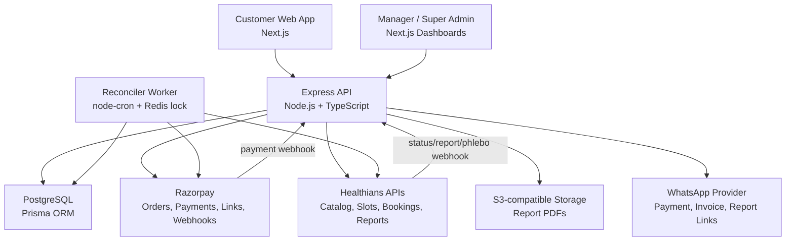

# DOCNOW

DOCNOW is a production healthcare diagnostics commerce platform for searching lab tests and health packages, booking collection slots, processing payments, integrating with Healthians, storing reports, and managing operations through manager and super-admin dashboards.

Live deployment: `docnow.in`

## What It Does

- Lets customers search diagnostic tests, packages, and profiles from an internal catalog synced from Healthians.
- Supports cart checkout, multi-patient bookings, address management, slot selection, Razorpay payments, promo codes, wallet usage, and booking lifecycle tracking.
- Integrates with Healthians for serviceability, product catalog, slots, booking creation, cancellation, reschedule, status, phlebo tracking, and reports.
- Processes Razorpay and Healthians webhooks with raw-body handling, signature/shared-secret validation, deduplication, and transactional updates.
- Provides manager and super-admin workflows for assisted orders, catalog pricing, categories, featured products, callbacks, corporate inquiries, exports, reports, wallets, referrals, failed orders, and audit logs.
- Stores report PDFs in S3-compatible object storage and supports customer-facing report/invoice delivery links.

## Architecture



## Tech Stack

Frontend:
- Next.js 16, React 19, TypeScript
- Tailwind CSS v4, Radix UI, Lucide React, Framer Motion
- Axios client with cookie/CSRF support and silent token refresh

Backend:
- Node.js, Express 5, TypeScript
- PostgreSQL, Prisma, Prisma migrations
- JWT auth, refresh-token rotation, CSRF protection, Helmet, Zod validation
- Razorpay, Healthians APIs, AWS S3 SDK, Upstash Redis, node-cron

Deployment:
- EC2, PM2, Nginx reverse proxy, Let's Encrypt SSL
- Manual `rsync` deployment with Prisma migration deployment

## Engineering Highlights

- Payment initiation is idempotent and keeps external network calls outside the database transaction.
- Promo redemption and wallet deduction are handled atomically with rollback paths.
- Partner booking finalization uses a database lease to prevent duplicate Healthians bookings.
- A reconciler worker recovers abandoned checkouts, stuck authorized payments, stale processing leases, and failed partner bookings.
- Razorpay and Healthians webhooks are mounted before JSON parsing so raw-body verification and dedupe work correctly.
- Healthians report webhooks create report records first, then background ingestion downloads and stores PDFs in durable object storage.
- Session management includes short-lived access tokens, refresh-token rotation, token reuse detection, session family revocation, and role-based access control.

## Documentation

- [Case Study](docs/case-study.md)
- [Project Overview](docs/project_overview.md)
- [Server Walkthrough](docs/server_walkthrough.md)
- [Client Walkthrough](docs/client_walkthrough.md)
- [Healthians Webhook Walkthrough](docs/healthians-webhook-walkthrough.md)
- [Local Docker Development](docs/local_docker.md)
- [Deployment Guidelines](docs/deployment_guidelines.md)
- [Report Delivery Pipeline Plan](docs/report-delivery-pipeline-plan.md)

## Local Development

Backend:

```bash
cd server
npm install
npx prisma generate
npm run dev
```

Frontend:

```bash
cd client
npm install
npm run dev
```

Required environment variables are documented in `server/.env.example` and `client/.env.example`.

Docker local stack:

```bash
docker compose up --build
```

See [Local Docker Development](docs/local_docker.md) for service details and caveats.

## Current Maturity

Strong:
- Production deployment
- Real healthcare partner integration
- Payment, webhook, retry, and report lifecycle handling
- Manager and admin operational workflows
- PostgreSQL domain model with audit, wallet, promo, catalog, report, and retry entities

Known gaps:
- No formal automated test suite yet
- No GitHub Actions CI/CD yet
- No Docker Compose or production Dockerfiles yet
- No infrastructure-as-code yet
- Observability is still mostly structured logs and alerts rather than full tracing/dashboarding
