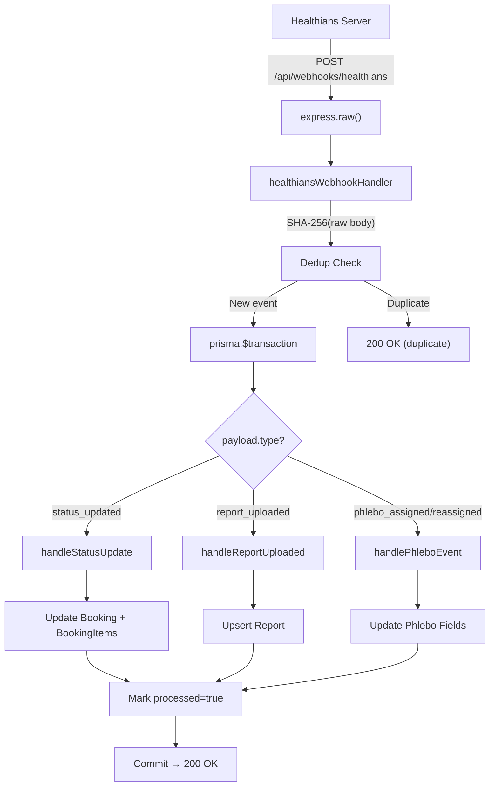

# Healthians Webhook Integration — Walkthrough

## What Was Built

A production-ready webhook endpoint at `POST /api/webhooks/healthians` that receives real-time Healthians booking events and updates the DocNow database atomically.

## Architecture

## BS Code Mapping (8 confirmed codes)

| Code | Status | Action | Source |
|---|---|---|---|
| BS002 | Order Booked | update | B2B API (cancelBooking) |
| BS003 | Cancelled | cancel | Webhook + B2B API |
| BS005 | Sample Collector Assigned | update | B2B API (cancelBooking) |
| BS007 | Sample Collected | update | B2B API (getBookingStatus) |
| BS008 | Sample Received at Lab | update | Webhook doc |
| BS0013 | Rescheduled | reschedule | Webhook doc |
| BS0018 | Resample Required | resample | B2B API (setSlotForBooking) |
| BS018 | Resample Required | resample | B2B API (variant) |

## Key Flows

### BS0018 — Lab Rejection / Resample
When Healthians lab rejects a sample, a new `ref_booking_id` is generated. The handler stores it in `rescheduledToId` and logs a warning. The `setSlotForBooking` API must be called with the new booking ID to assign a new collection slot.

### BS003 — Cancellation
The cancellation remark from Healthians (e.g., "CUSTOMER_CANCELLED") is stored in `partnerError` for user-facing display and audit.

### Report S3 URL Expiry
Report URLs are signed S3 links that expire in **1 hour** (`X-Amz-Expires=3600`). Current strategy: persist URL immediately. Fallback: `getCustomerReport_v2` API can fetch a fresh signed URL on demand.

## Files Created (5)

| File | Purpose |
|---|---|
| [healthiansStatusMap.ts](file:///home/rajanni/Desktop/DOCNOW/server/src/utils/healthiansStatusMap.ts) | 8 BS codes with source annotations |
| [healthiansWebhook.ts](file:///home/rajanni/Desktop/DOCNOW/server/src/services/healthiansWebhook.ts) | Business logic: status sync, cancel, reschedule, resample, report, phlebo |
| [healthians.ts](file:///home/rajanni/Desktop/DOCNOW/server/src/controllers/webhooks/healthians.ts) | Controller: raw body hash, secret validation, single-transaction |
| [index.ts](file:///home/rajanni/Desktop/DOCNOW/server/src/controllers/webhooks/index.ts) | Barrel export |
| [webhooks.ts](file:///home/rajanni/Desktop/DOCNOW/server/src/routes/webhooks.ts) | Placeholder route for future sources |

## Files Modified (3)

| File | Change |
|---|---|
| [schema.prisma](file:///home/rajanni/Desktop/DOCNOW/server/prisma/schema.prisma) | `WebhookEventV2`, `Booking` phlebo + partnerStatus + index, `Report` metadata + @@unique |
| [index.ts](file:///home/rajanni/Desktop/DOCNOW/server/src/index.ts) | Handler mounted before `express.json()` |
| [.env](file:///home/rajanni/Desktop/DOCNOW/server/.env) | `HEALTHIANS_WEBHOOK_SECRET` |

## Verification

- **TypeScript**: `tsc --noEmit` — ✅ clean
- **Prisma Client**: `prisma generate` — ✅ v5.22.0

## Before Going Live

1. Run `npx prisma migrate dev --name add_healthians_webhook_support`
2. Set `HEALTHIANS_WEBHOOK_SECRET` in Railway env vars
3. Share webhook URL with Healthians
4. Confirm if Healthians supports `x-healthians-secret` header
5. Get Healthians outbound IP ranges for allowlisting
