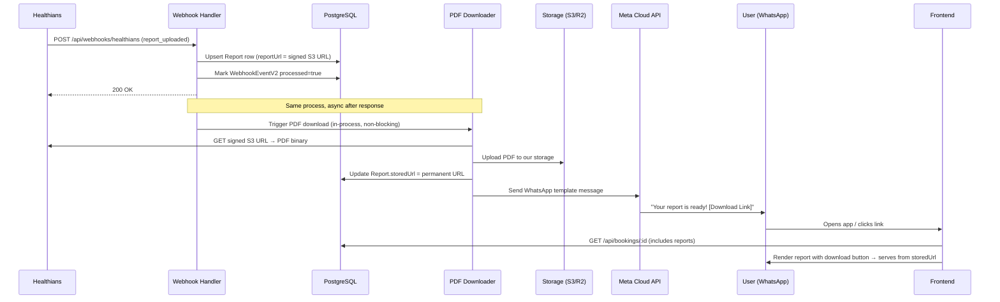

# Report Delivery Pipeline — System Design

## Problem Statement

When Healthians sends a `report_uploaded` webhook, we receive:
- A **signed S3 URL** (expires in **1 hour** — `X-Amz-Expires=3600`)
- Report metadata (`verified_at`, `full_report`, `vendor_customer_id`)

We need to:
1. **Persist** the report data in our DB
2. **Fetch** the PDF before the URL expires
3. **Store** it permanently in our own storage
4. **Notify** the user immediately via WhatsApp (Meta Cloud API)
5. **Serve** the report from our storage on the frontend

## Data Flow



## 4 Subsystems

---

### 1. PDF Fetcher & Storage

**The core problem:** Healthians' S3 URL expires in 1 hour. We MUST download the PDF and store it ourselves.

**Storage options (choose one):**

| Option | Cost | Complexity | Latency | Best For |
|---|---|---|---|---|
| **Cloudflare R2** | Free egress, $0.015/GB stored | Low | ~50ms | Budget-conscious, already on CF |
| **AWS S3** | $0.023/GB + egress fees | Medium | ~100ms | Already on AWS |
| **Supabase Storage** | 1GB free, then $0.021/GB | Low | ~80ms | Quick setup |
| **Local filesystem + serve** | Free | Lowest | N/A | Dev only, NOT for production |

> [!IMPORTANT]
> **Recommendation:** Cloudflare R2 or Supabase Storage for simplicity. Both have free tiers and S3-compatible APIs.

**Flow:**
```
1. Webhook receives report_uploaded
2. Upsert Report row with signed URL (reportUrl)
3. After 200 response, async: fetch PDF from signed URL
4. Upload to our storage → get permanent URL
5. Update Report.storedUrl = permanent URL
```

**Failure handling:**
- If download fails (network error), retry 3x with backoff within the 1-hour window
- If URL already expired, call `getCustomerReport_v2` API to get a fresh signed URL
- If storage upload fails, log error + keep original signed URL as fallback

---

### 2. WhatsApp Notification (Meta Cloud API)

**What we need:**
- Meta Business Account + WhatsApp Business API access
- Pre-approved **message template** (Meta requires template approval for business-initiated messages)
- Phone number registered with WhatsApp Business

**Template message example:**
```
🧪 Your test report is ready!

Hi {{1}},
Your lab report for booking #{{2}} is now available.

📄 Download your report: {{3}}

— DocNow
```

**Integration pattern:**
```typescript
// New file: server/src/adapters/meta.ts
POST https://graph.facebook.com/v21.0/{PHONE_NUMBER_ID}/messages
Headers: Authorization: Bearer {META_ACCESS_TOKEN}
Body: {
  messaging_product: "whatsapp",
  to: "{user_phone}",         // User's WhatsApp number
  type: "template",
  template: {
    name: "report_ready",     // Pre-approved template
    language: { code: "en" },
    components: [{
      type: "body",
      parameters: [
        { type: "text", text: "Rahul" },           // {{1}} user name
        { type: "text", text: "BOOK-12345" },       // {{2}} booking ID
        { type: "text", text: "https://docnow.in/reports/abc" } // {{3}} report link
      ]
    }]
  }
}
```

**Env vars needed:**
```
META_WHATSAPP_PHONE_ID=      # Your WhatsApp Business phone number ID
META_WHATSAPP_ACCESS_TOKEN=  # Permanent access token
META_WHATSAPP_TEMPLATE_NAME= # Approved template name (e.g., "report_ready")
```

> [!WARNING]  
> Meta requires template approval (takes 24-48 hours). Design and submit your template ASAP — this is on the critical path.

---

### 3. Report Serving API

**New endpoint:** `GET /api/reports/:reportId/download`

```
1. Auth: JWT required (user must own the booking)
2. Fetch Report from DB
3. If storedUrl exists → redirect to permanent URL
4. If only reportUrl exists (signed URL) → try redirect
5. If expired → call getCustomerReport_v2 → get fresh URL → redirect
```

**Alternatively**, the frontend can simply use `Report.storedUrl` directly from the booking detail response — no new endpoint needed if the storage URL is publicly accessible (pre-signed or public bucket).

---

### 4. Notification Timing & Reliability

**When to send the WhatsApp message:**

| Strategy | Pros | Cons |
|---|---|---|
| **A. After DB upsert, before PDF download** | User notified instantly | Link might use expiring URL |
| **B. After PDF stored in our storage** | Link is guaranteed permanent | 5-30 second delay |
| **C. After DB upsert, with our frontend link** | Instant + reliable | User sees "report processing" briefly |

> [!TIP]
> **Recommendation: Strategy C.** Send WhatsApp immediately with a link to your frontend (e.g., `https://docnow.in/bookings/{id}`). The frontend checks `storedUrl` — if not ready yet, shows "Report is being prepared..." with auto-refresh. This decouples notification speed from download speed.

---

## New Files

| File | Purpose |
|---|---|
| `server/src/adapters/meta.ts` | Meta WhatsApp Cloud API adapter |
| `server/src/services/reportDelivery.ts` | Orchestrates: fetch PDF → store → notify |

## Modified Files

| File | Change |
|---|---|
| `server/src/services/healthiansWebhook.ts` | After report upsert, trigger `reportDelivery.processReport()` |
| `server/prisma/schema.prisma` | No changes needed (storedUrl already on Report) |

## New Env Vars

| Variable | Required | Purpose |
|---|---|---|
| `META_WHATSAPP_PHONE_ID` | Yes | WhatsApp Business phone number ID |
| `META_WHATSAPP_ACCESS_TOKEN` | Yes | Meta Graph API access token |
| `META_WHATSAPP_TEMPLATE_NAME` | Yes | Approved template name |
| `STORAGE_BUCKET_URL` | Yes | R2/S3 bucket endpoint |
| `STORAGE_ACCESS_KEY` | Yes | Storage credentials |
| `STORAGE_SECRET_KEY` | Yes | Storage credentials |

## Open Questions

1. **Storage provider** — Do you already have a Cloudflare, AWS, or Supabase account? This determines the storage adapter.
2. **Meta Business Account** — Do you have WhatsApp Business API access, or do we need to set that up?
3. **Report link destination** — Should WhatsApp link go to:
   - (a) Direct PDF download URL, or
   - (b) Frontend booking page (where user sees report + can download)?
4. **Partial reports** — Healthians can send multiple partial reports before the full report. Should we notify the user on every partial, or only on `full_report=1`?
5. **User phone number format** — Is the phone number stored in our DB with country code (`+91...`) for WhatsApp delivery?
